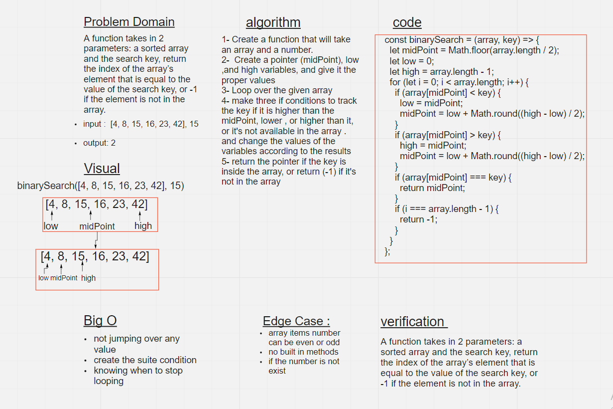

# Insert to Middle of an Array

A function takes in 2 parameters: a sorted array and the search key, return the index of the array’s element that is equal to the value of the search key, or -1 if the element is not in the array.

## Whiteboard Process

## Approach & Efficiency

1.  first I took my time to understand the problem
1.  I solved the challenge on a text editor
1.  I started drawing the white-board
1.  It took me 90 minutes to complete the challenge
