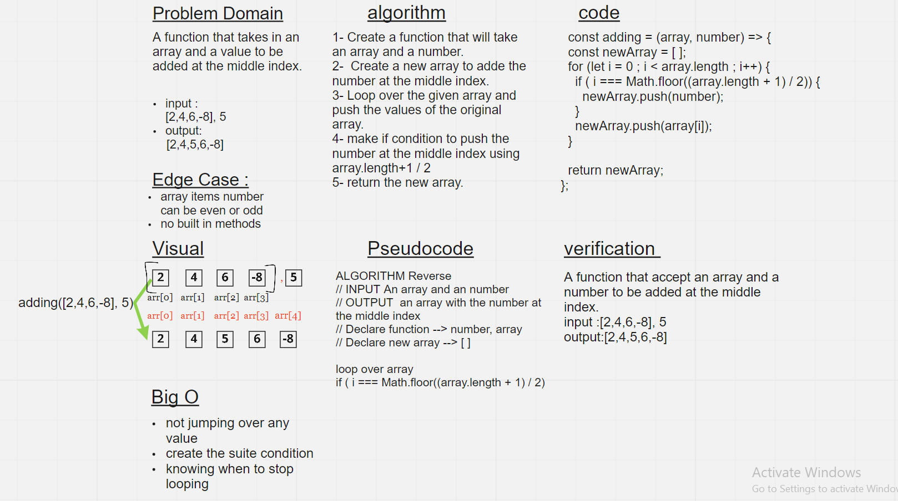

# Insert to Middle of an Array

Write a function called `insertShiftArray` which takes in an array and a value to be added. Without utilizing any of the built-in methods available to your language, return an array with the new value added at the middle index.

## Whiteboard Process

## Approach & Efficiency

1.  first I took my time to understand the problem
1.  I solved the challenge on a text editor
1.  I started drawing the white-board
1.  It took me 90 minutes to complete the challenge
1.  Big Os: not jumping over any value, create the suitable condition, and knowing when to stop looping.
