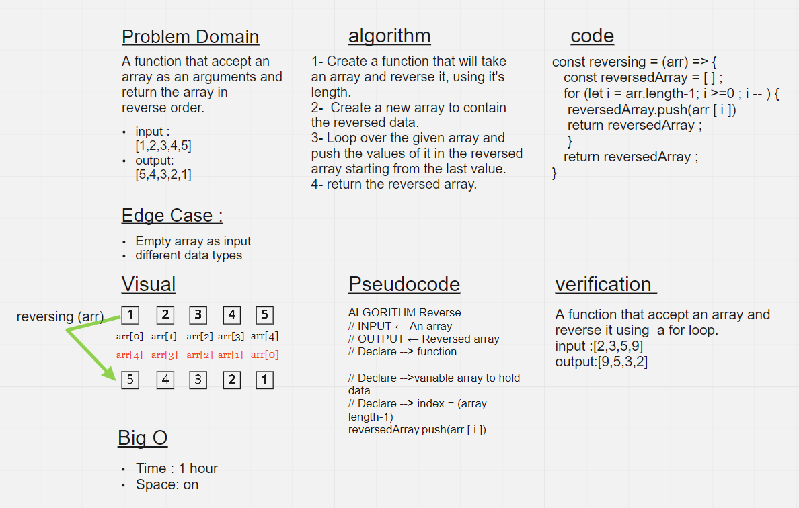

# Reverse an Array

Write a function called `reverseArray` which takes an array as an argument. Without utilizing any of the built-in methods available to your language, return an array with elements in reversed order.

## Whiteboard Process

## Approach & Efficiency

1.  first I took my time to understand the problem
1.  I solved the challenge on a text editor
1.  I started drawing the white-board
1.  It took me 1 hour to complete the challenge
