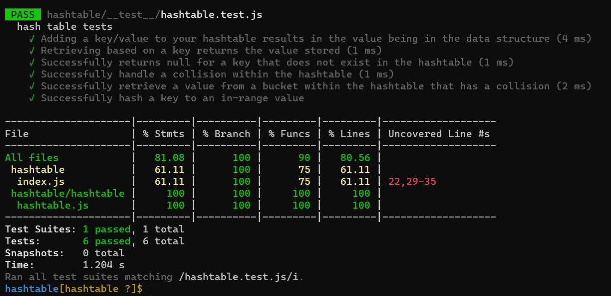

# Hashtables

Hash table (hash map) is a data structure that implements an associative array abstract data type, a structure that can map keys to values. A hash table uses a hash function to compute an index, also called a hash code, into an array of buckets or slots, from which the desired value can be found. During lookup, the key is hashed and the resulting hash indicates where the corresponding value is stored.

## Challenge

creating the following methods method:

- add:
  - This method will add a key-value elements in the hash map, dealing with collisions.
- get:
  - This method takes one argument. A key, and returns the value of the corresponding key if exist .
- contains:
  - This method takes an key as an argument and return a boolean weather the key exist or not in the map.
- hash:
  - This method takes a key as an argument and return the index that corresponds with that key

## Approach & Efficiency

I took the implementation path, where I start writing code and tests my result step by step.

### Efficiency

Time:

- add: O(1)
- get: O(1)
- contains: O(1)
- hash: O(1)

Space:

- add: O(n)
- get: O(1)
- contains: O(1)
- hash: O(1)

## API

#### add()

Provide a key and a value and this method will convert the key to a hash-code and adds it to the map.

ex)

```
const hashMap = new Hashtable(5000);
hashMap.add('one', 'test1');
hashMap.add('two', 'test2');
```

#### get()

Provide a key and this method will return the value of that key if exist and error if not.  
ex)

```
const hashMap = new Hashtable(5000);
hashMap.add('one', 'test1');
hashMap.get('one');
```

- returns `test1`

#### contains()

Provide a key and this method will return a boolean indicating if the key exist of not.  
ex)

```
const hashMap = new Hashtable(5000);
hashMap.add('one', 'test1');
hashMap.contains('one');
```

- returns `true`

#### hash()

Provide a key and this method will return the index of that key if exists or throw an error if not.  
ex)

```
const hashMap = new Hashtable(5000);
hashMap.add('one', 'test1');
hashMap.hash('one')
```

- returns `2878`

## Tests


