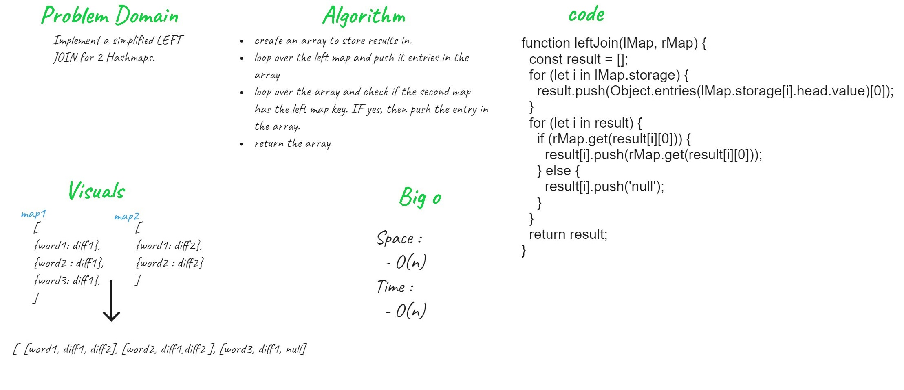

# HashMap Left Join

The `SQL LEFT JOIN` returns all rows from the left table, even if there are no matches in the right table. This means that if the ON clause matches 0 (zero) records in the right table; the join will still return a row in the result, but with NULL in each column from the right table.

This means that a left join returns all the values from the left table, plus matched values from the right table or `NULL` in case of no matching join predicate.

## Challenge

Write a function that LEFT JOINs two hashmaps into a single data structure:

- It takes two hash maps as arguments.
- It return the result of left join.

## Approach & Efficiency

I took the implementation path, where I start writing code and tests my result step by step.

### Efficiency

Time:

- O(n)

Space:

- O(n)

## Code

```
function leftJoin(lMap, rMap) {
  const result = [];
  for (let i in lMap.storage) {
    result.push(Object.entries(lMap.storage[i].head.value)[0]);
  }
  for (let i in result) {
    if (rMap.get(result[i][0])) {
      result[i].push(rMap.get(result[i][0]));
    } else {
      result[i].push('null');
    }
  }
  return result;
}

```

### Whiteboard


