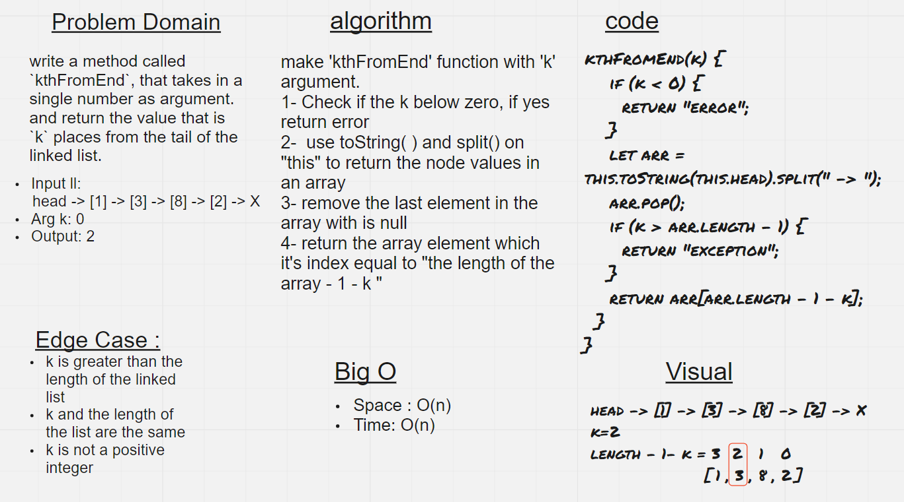

# Linked List kth

## Challenge

- write a method called `kthFromEnd`, that takes in a single number as argument. and return the value that is `k` places from the tail of the linked list.

## Whiteboard Process

## Approach & Efficiency

### Approach

1. I understood the problem first.
1. I imagined how the results should be.
1. I made a drawings of how the `linked list` would be after insertion of multiple `nodes`.
1. I wrote the algorithm.
1. I wrote the code.
1. I made the tests.

### Efficiency

- Space : O(n)
- Time : O(n)

## API

### How to Use

- To output a value from a list :  
  `<list name>.kthFromEnd(<number>)`

### Test

- `npm run test`
- `npm run watch`
