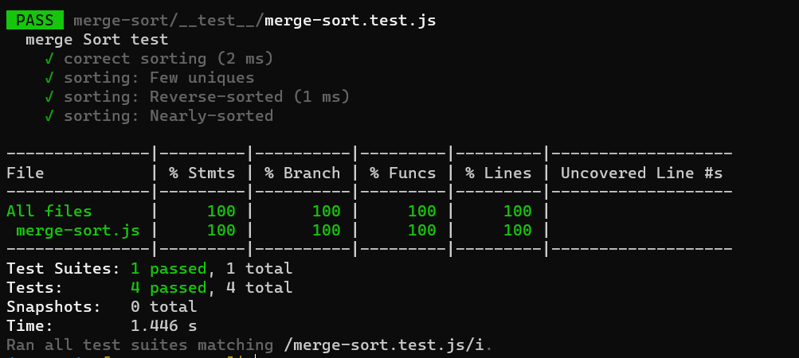

# Merge Sort

##### Merge sort is a sorting algorithm that uses the “divide and conquer” concept. Given an array, we first divide it in the middle and we get 2 arrays. We recursively perform this operation, until we get to arrays of 1 element.

### Pseudocode

```js
ALGORITHM Mergesort(arr)
    DECLARE n <-- arr.length

    if n > 1
      DECLARE mid <-- n/2
      DECLARE left <-- arr[0...mid]
      DECLARE right <-- arr[mid...n]
      // sort the left side
      Mergesort(left)
      // sort the right side
      Mergesort(right)
      // merge the sorted left and right sides together
      Merge(left, right, arr)

ALGORITHM Merge(left, right, arr)
    DECLARE i <-- 0
    DECLARE j <-- 0
    DECLARE k <-- 0

    while i < left.length && j < right.length
        if left[i] <= right[j]
            arr[k] <-- left[i]
            i <-- i + 1
        else
            arr[k] <-- right[j]
            j <-- j + 1

        k <-- k + 1

    if i = left.length
       set remaining entries in arr to remaining values in right
    else
       set remaining entries in arr to remaining values in left

```

### code

```js
const mergeSort = (arr) => {
  let n = arr.length;
  if (n > 1) {
    let mid = n / 2;
    let left = arr.slice(0, mid);
    let right = arr.slice(mid, n);
    mergeSort(left);
    mergeSort(right);
    merge(left, right, arr);
  }
  return arr;
};

const merge = (left, right, arr) => {
  let i = 0;
  let j = 0;
  let k = 0;
  while (i < left.length && j < right.length) {
    if (left[i] <= right[j]) {
      arr[k] = left[i];
      i++;
    } else {
      arr[k] = right[j];
      j++;
    }
    k++;
  }
  if (i === left.length) {
    while (k < arr.length) {
      arr[k] = right[j];
      j++;
      k++;
    }
  } else {
    while (k < arr.length) {
      arr[k] = left[i];
      i++;
      k++;
    }
  }
};
```

### BigO

- Space : O(n)
- Time: O(n)

### Tests

[inserionSort.test.js](./__test__/merge-sort.test.js)

