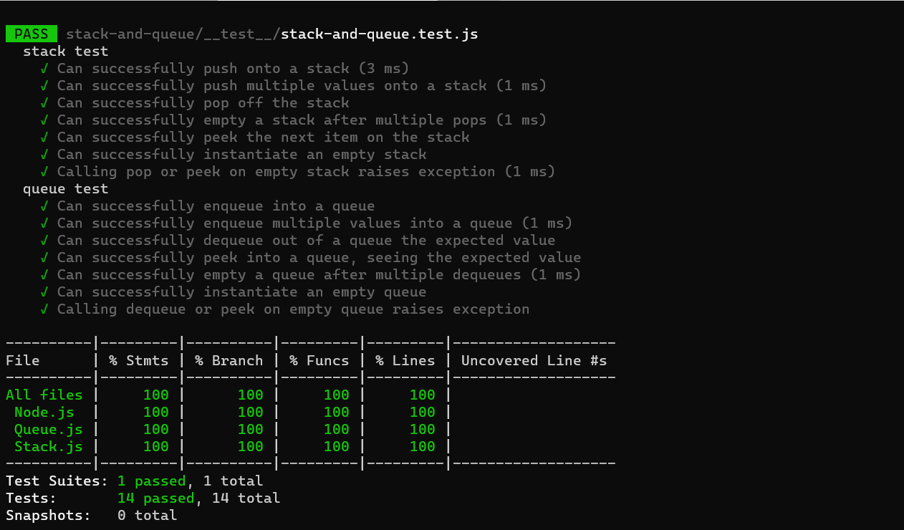

# Stacks and Queues

`Stacks` works on the principle of **FILO**, where the first item inter the stack will be the last item to get out.

`Queues` works on the principle of **FIFO**, where the first item to enter the queue will be the first item to get out of it.

## Challenge

- create a class called `Node` that holds two properties, value and next.
- create a class called `Stack` that holds one property, front. After that :
  - create a `push` method to add a node to the end of the stack.
  - create a `pop` method to remove a node from the the front of the stack.
  - create a `peek` method to return the front node of the stack, and exception if the stack is empty
  - create a `is empty` method to check if
- create a class called `Queue` that holds one property, front. After that:
  - create a method called `enqueue` to add a node to the back of the queue, with time performance of O(1).
  - create a method called `dequeue`to remove the front node of the queue, with time performance O(1).
  - create a method called `peek` to return the front value of the queue.
  - create a method called `is empty` to check if the queue is empty.

## Tests

## Approach & Efficiency

For the stack I create a class with one property and all of its methods. The time performance was O(1) for all methods, and space performance was O(n) for `push` and `pop`.  
For the queue the time performance was O(1) for all methods, and space performance was O(n) for `enqueue` and `dequeue`.

## API

1. Stack:

- To instantiate a new stack => `const || let <name> = new Stack()`
- To add a node to the front of the stack => `<name>.push(<value>)`
- To remove a node from the front of the stack => `<name>.pop()`
- To peek on the front value of the stack => `<name>.peek()`
- To check wether the stack is empty or not => `<name>.isEmpty()`

2. Queue:

- To instantiate a new queue => `const || let <name> = new Queue()`
- To add a node to the back of the queue => `<name>.enqueue(<value>)`
- To remove a node from the front of the queue => `<name>.dequeue()`
- To peek on the front value of the queue => `<name>.peek()`
- To check wether the queue is empty or not => `<name>.isEmpty()`
