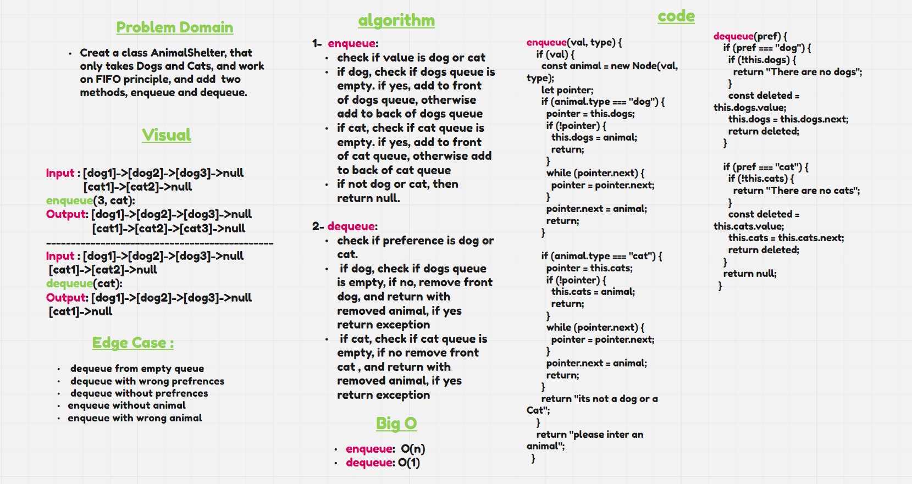

# First-in, First out Animal Shelter.

## Challenge

- Create a class called AnimalShelter which holds only dogs and cats.
- The shelter operates using a first-in, first-out approach.
- Implement two methods. The first one, is `enqueue`, and the second one is `dequeue`.

## Whiteboard Process

## Approach & Efficiency

### Approach

1.  understood the problem first.
1.  imagine how the results should be.
1.  made a drawings of how the `list` would be after insertion of multiple `cats` and `dogs`.
1.  wrote the algorithm.
1.  wrote the code.
1.  made the tests.

### Efficiency

- enqueue: O(n)
- dequeue: O(1)

## API

### How to Use

- To add a cat : `<list-name>.enqueue(<animal name>, "cat");`.
- To add a dog : `<list-name>.enqueue(<animal name>, "dog");`.
- To remove an animal : `<list-name>.dequeue(<animal name>, "dog/cat");`.

### Test

- `npm run test`

## Code

[stack-queue-animal-shelter.js](./stack-queue-animal-shelter.js)
