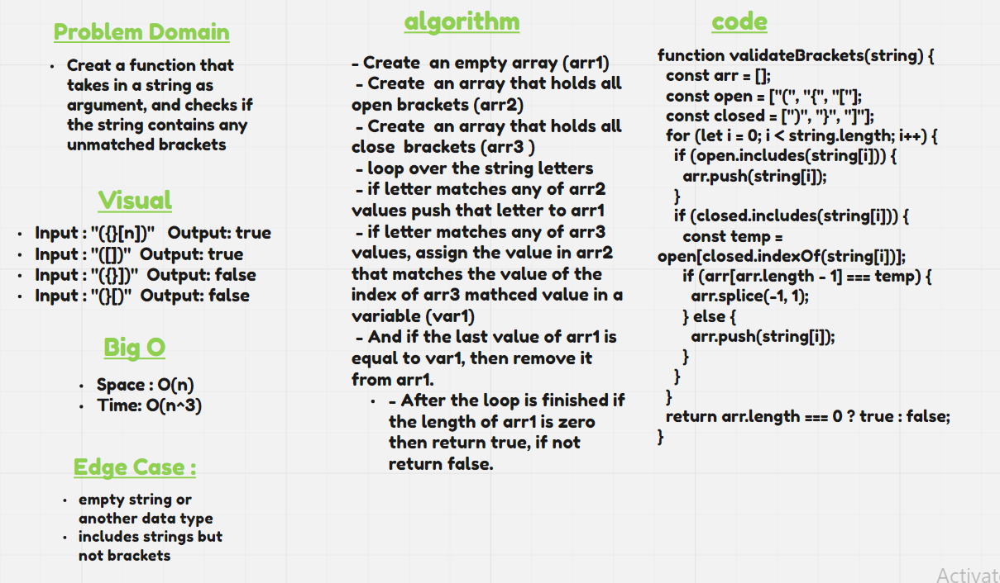

# Stacks and Queues

Creat a function that takes in a string as argument, and checks if the string contains any unmatched brackets

## Whiteboard Process

### Efficiency

- Space :
  - O(n)
- Time :
  - O(n^3)

## code

[stack-queue-brackets.js](./stack-queue-brackets.js)
