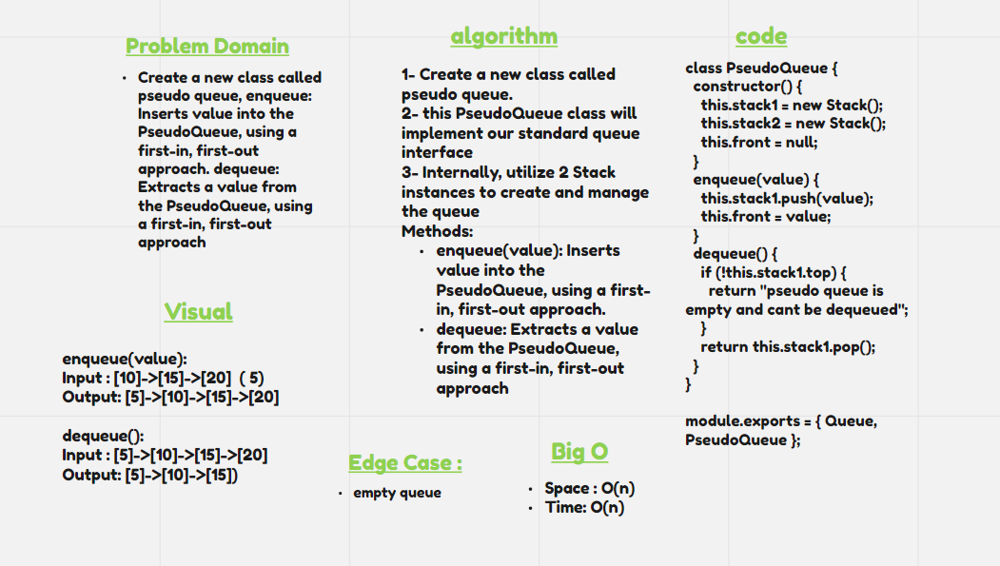

# Stacks and Queues

`Stacks` works on the principle of **FILO**, where the first item inter the stack will be the last item to get out.

`Queues` works on the principle of **FIFO**, where the first item to enter the queue will be the first item to get out of it.

## Whiteboard Process

## Approach & Efficiency

1. I understood the problem first.
1. I imagined how the results should be.
1. I made a drawings of how the queue would be.
1. I wrote the algorithm.
1. I wrote the code.
1. I made the tests.

## Solution

[Queue.js](./Queue.js)
